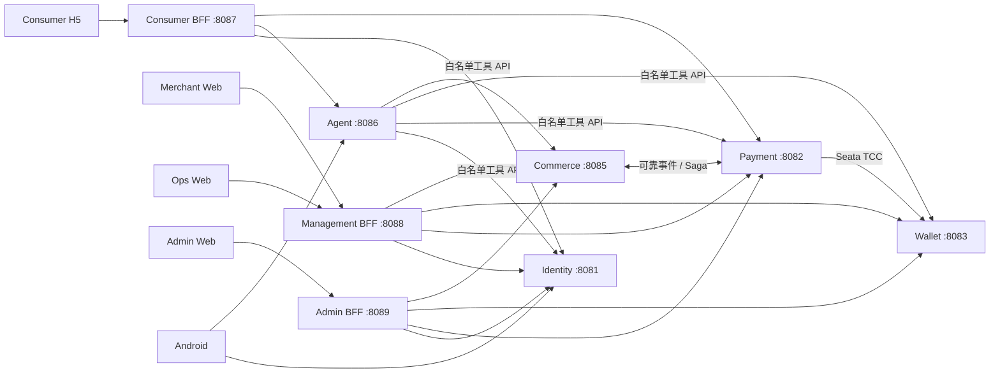

# MiniPay 源码事实地图

## 1. 系统入口



## 2. 服务职责与数据所有权

| 模块 | 端口 | 数据 owner | 允许做什么 | 绝对不能做什么 |
|---|---:|---|---|---|
| identity-service | 8081 | 用户、凭证、OAuth Client、角色、授权 | 登录、发 Token、RBAC、支付授权 | 修改余额、支付单、外卖订单 |
| payment-service | 8082 | 支付、退款、转账、商户与应用、通道回调 | 支付编排、幂等、启动 TCC | 直接更新 Wallet 表或外卖订单 |
| wallet-service | 8083 | 钱包、冻结、账务事务、复式账本 | 余额和账本原子更新、TCC 分支 | 提供任意改余额接口 |
| commerce-service | 8085 | 商家、商品、库存、购物车、地址、外卖订单 | 权威结算、履约、取消退款编排 | 修改支付状态或钱包余额 |
| agent-service | 8086 | 会话、消息、Run、工具 Trace、记忆 | 意图识别、SSE、受控工具调用 | 直连业务库、接收支付密码或完整 Token |
| consumer-bff | 8087 | Web Session、临时 CSRF 状态 | 消费者 Web 的 OAuth Client 与 API/SSE 代理 | 保存业务真相 |
| management-bff | 8088 | 管理端 Session、临时 CSRF 状态 | 商户/运营登录与 API 聚合 | 绕过资源服务权限和租户校验 |
| admin-bff | 8089 | 系统管理 Session、临时 CSRF 状态 | 独立管理员登录和只读跨域聚合 | 修改余额和账本、复用运营信任域 |

## 3. 基础设施

| 组件 | 当前用途 | 关键边界 |
|---|---|---|
| MySQL 8.4 + Flyway | 每个业务服务使用独立 Schema | 禁止跨服务读写数据库 |
| Redis 7.4 | 验证码、限流、短会话、BFF Session、缓存 | 不是订单和余额真相源 |
| RabbitMQ 4.1 | 当前可靠事件传输；后续渐进迁移到 RocketMQ | 业务可靠性仍依赖 Outbox/Inbox 和幂等 |
| Seata 2.6 | Payment 协调、Wallet TCC 分支 | 只用于短时、可补偿资金动作 |
| Docker Compose | 本地编排、DNS、健康检查、环境注入 | 容器通过服务名访问，不使用彼此的 localhost |

当前没有 Nacos、Eureka、Consul 或 Spring Cloud Gateway。本地服务发现使用 Compose DNS；迁移 Kubernetes 后使用 Service、ConfigMap 和 Secret。三个 BFF 是客户端信任边界，不等于统一网关。

## 4. 三条必须会讲的业务链

### 站内转账

```text
客户端 → Payment 创建转账意图并校验支付授权
→ Payment 启动 Seata 全局事务
→ Wallet Debit Try + Credit Try
→ Seata 回调 Confirm 或 Cancel
→ Wallet 在本地事务中同步维护余额与复式账本
```

### 外卖支付 Saga

```text
Commerce 创建外卖订单并写 Outbox
→ MQ → Payment Inbox 去重并创建/推进支付
→ Payment 写支付结果 Outbox
→ MQ → Commerce Inbox 去重并推进外卖订单
```

### Web 登录与调用

```text
浏览器 → BFF 的 OAuth/OIDC 登录
→ 浏览器只持 HttpOnly Cookie
→ BFF 在 Redis 保存 Session，并代理业务 API
→ 资源服务仍校验 audience、scope、角色与租户
```

## 5. 阅读代码的固定方法

一次只选一个用户动作，按以下方向阅读：

```text
前端请求路径
→ interfaces/Controller 或消息 Listener
→ application/use case
→ domain 状态与规则
→ application port
→ infrastructure 的数据库、HTTP、MQ 或 Seata 实现
→ Flyway 表结构与测试
```

不要从工具类、所有 Controller 或全部 SQL 开始扫。每走完一条链，回答五个问题：谁发起、谁负责、数据写哪、失败在哪、如何恢复。
